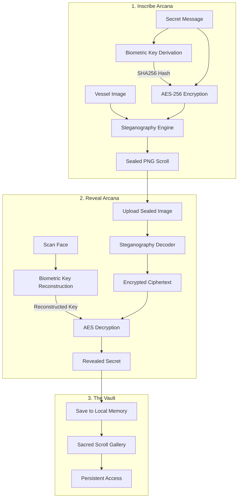

# Vitra Arcana: Canvas of Secrets

A Renaissance-inspired web experience where secrets are hidden within art and locked by your biology. Using advanced steganography and biometric key derivation, **Vitra Arcana** turns the act of hiding a message into a ritual of digital alchemy.

---

## 🏛️ The Great Ritual (Workflow)



---

## 🗝️ Key Features

- **Biometric Key Derivation**: Unlike traditional FaceID which just says "Yes/No," we derive a unique cryptographic key directly from your facial geometry using a **Fuzzy Extractor** scheme.
- **Steganographic Sealing**: Messages are woven into the bitstream of an image. They are invisible to the naked eye and leave no digital footprint.
- **Zero-Storage Privacy**: Your secrets never touch a server. All encryption, decryption, and "memory" (The Vault) happen entirely on your local device.
- **Hackathon-Grade Performance**: Optimized with GPU (WebGL) acceleration for near-instant 100ms face tracking and auto-capture.

### 📜 Technical Stack
- **Biometrics**: `@vladmandic/face-api` (TensorFlow.js) with WebGL acceleration.
- **Cryptography**: `CryptoJS` (AES-256, SHA-256).
- **Frontend**: React 19 + Vite + Tailwind CSS + Framer Motion.
- **Icons**: Lucide React.

---

## 🏺 How to Run

1.  **Clone & Enter**:
    ```bash
    cd CanvasofSecrets
    ```
2.  **Install**:
    ```bash
    npm install
    ```
3.  **Ignite**:
    ```bash
    npm run dev
    ```
4.  **Witness**: Open [http://localhost:3000](http://localhost:3000)

---
*© MCCCCLII Vitra Arcana. All secrets reserved.*
